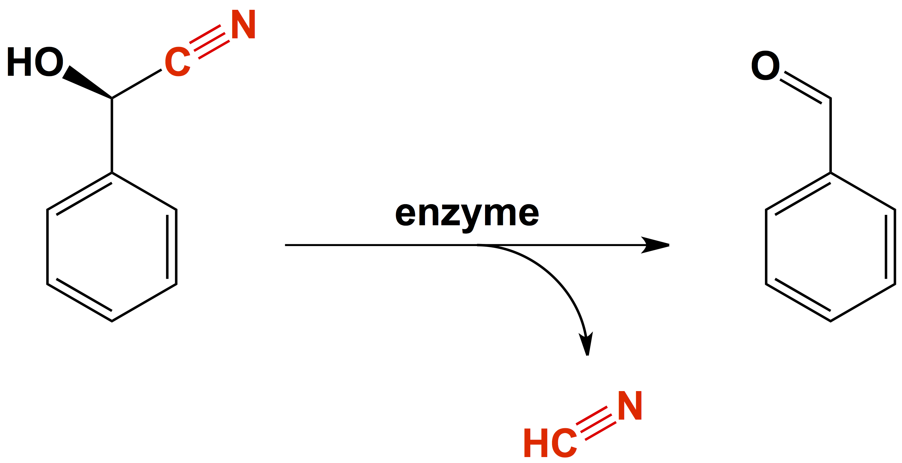

Remember the first death in Agatha Christie's "And Then There Were None"?

Anthony Marston

As sessile organisms, many plants use chemical strategies to protect themselves from external attack, and poisoning attackers with cyanide is one of them! So far, more than 3000 species of plants have been identified that are capable of cyanogenesis. To do this, plants produce cyanide-containing compounds called cyanogens, for example, mandelonitrile (Figure 1). These cyanogens are inactive and generally not poisonous, so the plant cells can produce and store them in special compartments inside their cells without harming itself. In nearby but separate compartments, plants also store a special enzyme capable of transforming the inactive cyanogen into hydrogen cyanide. Then, when insects or other animals bite down on the leaves of the plant, the compartments' walls are crushed, mixing the cyanogen with the enzyme and releasing hydrogen cyanide right inside the attackers mouth!

Cyanogens come in many forms. Oftentimes they accumulate as 

